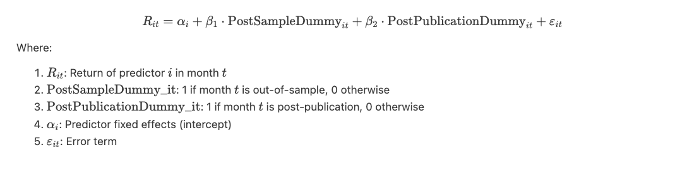

Key issues we need to fix!!!!!  BASICALLY --> replicate the predictor used in Lazy Prices, run the portfolio simulation, and report your findings — not to overcomplicate it.


1. What exactly are we replicating? (Need to Clarify that your core project is a replication of the lazy prices signal measurement, and not a broad study of multiple predictors.)
   We mixed two ideas. A.replicating the lazy prices paper B. using various predictors from the OAP
2. Are we computing and present lazy prices statistics clearly?
   We did not show that we will recompute detailed stats for lazy prices
3. Build too much???? Overbuilding,duplicating 
4. A lot of extra data and predictor


# **Research Proposal: Lazy Prices**  
**Does academic research destroy stock return predictability**  
https://onlinelibrary.wiley.com/doi/abs/10.1111/jofi.12365

---

## **Research Question**

### **What do we want to know or what problems are we trying to solve?**

**The “bigger” question:**  
Does publishing academic research findings reduce or eliminate the ability to predict stock returns, contributing to market efficiency by informing investors about mispricings?

Change: How does the performance of the Lazy Prices signal change across in-sample, out-of-sample, and post-publication periods — and what does this tell us about overfitting and investor learning? 

**The specific research question we are trying to answer:**  
Are returns lower or still show the same level of profitability after an academic paper is published.


---

## **Project Hypotheses**

Our project is testing relationships — specifically, how stock return predictability changes across different time periods (in-sample, out-of-sample, and post-publication).  
Return predictability means the ability of a known variable (a “predictor”) to forecast future stock returns. So “return predictability decreases,” means that the average returns from trading on that predictor get smaller, meaning that the predictor becomes less useful or informative after it’s been discovered or published.

- **H1:** Return predictability decreases out-of-sample due to statistical bias.  
- **H2:** Return predictability decreases further post-publication due to investor learning.

Specifically, we will compare returns during:
- The original study period (in-sample),
- The period after the study ends but before publication (out-of-sample), and
- The period after publication (post-publication).

This design will help us isolate the effects of statistical over-fitting (which causes bias in in-sample results) and the effect of public awareness (which reflects how investors learn from published academic research).
### **In-sample (t₀ to t₁):**  
This is the period used to identify the predictor. We will test and report strong returns patterns here because the predictor is selected and optimized during this period. There is a high chance of over-fitting or data mining, since researchers know the data and can choose variables that perform well in this exact time frame.

To apply a predictor to historical data, we:
1. Calculate the predictor for each stock using historical information — for example, book-to-market ratio, moor past 12-month returns.  
2. Rank the stocks based on their predictor values.  
3. Form a portfolio, usually by going long on the top-ranked stocks (top quintile) and short on the bottom-ranked stocks (bottom quintile).  
4. Track the portfolio’s performance over time using historical return data.

### **Out-of-sample (t₁ to t₂):**  
This period begins after the original study ends but before the academic paper is officially published. It allows us to test whether the predictor still performs well when researchers are no longer choosing variables based on in-sample success. In other words, the predictor is applied to new data that was not available during its construction phase.

The goal here is to detect statistical bias, such as over-fitting or data mining. If the returns drop significantly compared to the in-sample period, it suggests that the original results may not generalize well and were possibly influenced by chance patterns in the historical data.

To apply the predictor in the out-of-sample period (t₁ to t₂), we:
1. Use only historical data available at each point in time (prior to each return period) to calculate the predictor value for each stock.
2. Rank the stocks from high to low using the frozen predictor values.
3. Form a long-short portfolio: go long on the top-ranked stocks (top quintile) and short on the bottom-ranked stocks (bottom quintile), as in the in-sample step.
4. Track the portfolio’s performance during the out-of-sample period using realized future returns — this tests whether the predictor generalizes to new data.

### **Post-publication (t₂ to t₃):**  
This is the period after the predictor becomes public. If returns drop further here, it suggests that investors learned about the predictor and traded on it, reducing its effectiveness.

Finally, we will subtract post-publication return decay from out-of-sample return decay to obtain the effects of publishing a predictor.

To apply the predictor in the post-publication period (t₂ to t₃), we:
1. At each time step, calculate the predictor using data available at that time (if investors are using the published strategy).
2. Rank stocks again based on predictor values and form the same type of long-short portfolio.
3. Simulate investor behavior by assuming market participants have read the publication and started using the strategy.
4. Track the long-short portfolio’s returns through the post-publication period and compare the performance to the out-of-sample period.


Change:
- **H1 (In-sample):**  
  The Lazy Prices signal generates strong and statistically significant long-short returns in the in-sample period (1994–2003), when the signal is first developed.  
  This period is used to discover and optimize the signal. The high performance may partly come from overfitting or data mining.

- **H2 (Out-of-sample):**  
  The signal’s return decreases in the out-of-sample period (2004–2007), but still remains statistically significant.  
  This tests if the signal works on new data that was not used during signal construction. If performance drops, it suggests that the original results were possibly too optimistic.

  
- **H3 (Investor learning):**  
  In the post-publication period (2008–2014), the signal’s return decreases even more, and may become statistically insignificant.  
  This may happen because investors read the published paper and start trading based on the strategy, reducing its profit. This would support the idea of semi-strong market efficiency, where public information is quickly priced in.

- **H4 (Stronger decay after publication):**  
  The return drop from the out-of-sample period to the post-publication period is larger than the drop from the in-sample to out-of-sample period.  
  This would suggest that the publication itself has a meaningful effect on return decay, beyond just statistical overfitting. It provides evidence that market participants react to academic research once it becomes public.


---

### **What are our metrics of success? Baseline from prior work:**

- **Metrics:** Decline in long-short portfolio returns  
- **Baseline:**
  - 26% average return decay out-of-sample  
  - 58% average return decay post-publication  
  - Implied publication effect: ~32%

---

## **Necessary Data**

### **What does the final dataset need to look like (mostly dictated by the question and the availability of data):**  
A panel dataset (observations over time for multiple entities) of monthly long-short portfolio returns for each predictor, labeled by in-sample, out-of-sample, and post-publication periods.

- Entities: Different predictors (97 of them in the original paper, ~12 for our replication)  
- Time: Monthly return data  
- Variables: Predictor Portfolio returns, time period labels (in-sample, out-of-sample, post-publication), etc.

Each row will be:

```
[Predictor i, Month t, Return, Time Period Type]
```

Example:

| predictor      | month    | return | post_sample | post_publication |
|----------------|----------|--------|-------------|------------------|
| book-to-market | 2001-01  | 0.006  | 0           | 0                |
| book-to-market | 2001-02  | 0.005  | 1           | 0                |
| volatility     | 2001-01  | 0.010  | 0           | 0                |
| volatility     | 2001-02  | 0.004  | 0           | 1                |

---

### **Main regression:**



---

### **What is an observation, e.g. a firm, or a firm-year, etc.?**  
Observation: A predictor-month (i.e., monthly return of a long-short portfolio formed using one predictor).

### **What is the sample period?**  
The full sample period is **January 1926 to December 2013** in the original paper. Each predictor will have its own in-sample, out-of-sample, and post-publication sub-periods, based on the original study period and the publication date of the corresponding academic paper.

### **What are the sample conditions? (Years, restrictions you anticipate)**  
- S&P 500 common stocks only (CRSP share codes 10 and 11)  
- Exclude financial companies and companies that have very small market capitalization  
- Publicly available variables only: stock prices and returns (from CRSP) and accounting data from company financial statements (Compustat)

---

### **What variables are absolutely necessary and what would you like to have if possible?**

**Absolutely necessary:**
- Monthly stock returns  
- Predictor values  
- Predictor sample period and publication date  
- Market cap, volume, bid-ask spreads  
- Industry factors (for idiosyncratic risk)
- CIK

**Nice to have:**
- Short interest  
- Analyst forecast revisions  
- Dividend payment flags
- Total assest
- Net income
- cash flow

Change:
Sentiment scores for 10-k
Monthly firm returns
Market cap
Portfolio rankings
Time range 


---

### **What data do we have and what data do we need?**

**Have:** Paper  
**Need:**
- Monthly CRSP data → request from Professor  
- 10-K reports → cleaned dataset from Bill McDonald's website (U of Notre Dame)  
  → used to derive predictor definitions and construct the final dataset
- Compustat Fundamentals 
  - To calculate key accounting-based predictors (e.g., book-to-market, ROE, asset growth)
- Predictor metadata 
  - Sample period used in each study  
  - Date of publication (for time labeling)  
- MasterIndex_Aggregate_10X_1993-2024.txt
  - For linking SEC filings and identifying filing dates if using time-sensitive text data

---

### **How will we collect more data?**

- Retrieve monthly CRSP from Professor  
- Download cleaned 10-K reports from U of Notre Dame website
- Download or reconstruct predictor formulas using prior academic literature  
- Pull Compustat firm fundamentals from WRDS  
- Cross-reference firm identifiers (CIK, PERMNO, CUSIP) for dataset merging


---

### **Raw inputs and folder structure**

```
/data/
    /raw/
        crsp_monthly.csv
        predictor_definitions.csv
        /10_k-cleaned/…
    /processed/
        predictor_returns.csv
/code/
    clean_crsp.ipynb
    build_sentiment.ipynb
    build_portfolios.ipynb
    run_analysis.ipynb
/output/
    proposal.md
    proposal_final.md
    summary_results.csv
    figs/
```

---

### **Speculation about transforming data into its final form**

1. Clean CRSP and align monthly returns  
2. Create 12 predictors using historical definitions and sentimental analysis  
3. Form long-short portfolios by predictor using top and bottom quintiles  
4. Label time periods (in-sample, out-of-sample, post-publication)  
5. Run regressions to estimate return decay and publication effect

